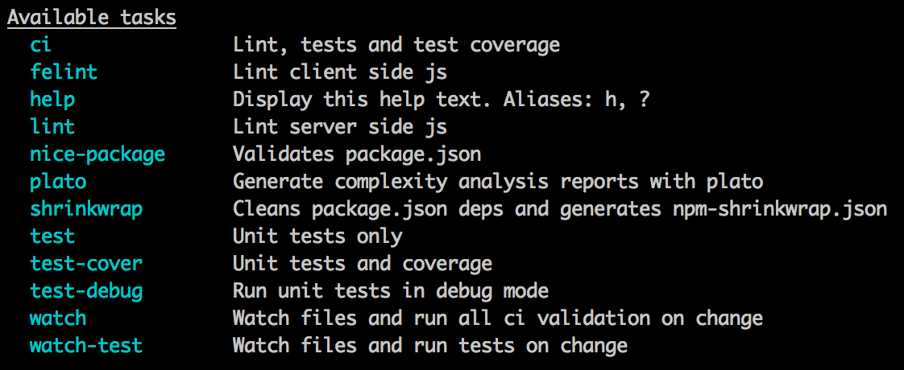

# load-common-gulp-tasks
> Load common [gulp](http://gulpjs.com/) tasks and configs so you don't need to redefine them for every module

## Available Tasks

`gulp help` for available tasks. Right now these are the default tasks:



## Basic Usage

```js
// gulpfile.js
var gulp = require('gulp');
require('load-common-gulp-tasks')(gulp);
```

## Defaults

`load-common-gulp-tasks` tries to assume smart defaults but also attempts to be very configurable.
Below are the default options which can be overridden by passing an `options` object
as the second parameter, e.g. `require('load-common-gulp-tasks')(gulp, options);`

```js
  var options = {
    coverageSettings: {
      thresholds: {
        statements: 80,
        branches: 70,
        lines: 80,
        functions: 80
      },
      coverageDirectory: './target/coverage',
      rootDirectory: ''
    },
    paths: {
      lint: [
        './gulpfile.js',
        './lib/**/*.js',
        './test/**/*.js'
      ],
      felint: [
        './content/scripts/**/*.js'
      ],
      cover: [
        './lib/**/*.js'
      ],
      test: [
        './test/**/*.js'
      ]
    },
    jshintrc: {
      server: './node_modules/load-common-gulp-tasks/lint/.jshintrc',
      client: './node_modules/load-common-gulp-tasks/felint/.jshintrc'
    }
  };
```

## Advanced Usage

To override default tasks or create new ones, simply define them after calling `require('load-common-gulp-tasks')(gulp);` in your `gulpfile.js`, e.g.

```js
var gulp = require('gulp'),
  sass = require('gulp-sass'),
  rename = require('gulp-rename'),
  bourbon = require('node-bourbon').includePaths,
  neat = require('node-neat').includePaths,
  libPath = 'lib',
  sassPath = libPath + '/*/sass',
  sassFiles = sassPath + '/*.scss',
  options;

// ------------------------
// custom coverage settings
// ------------------------
options = {
  coverageSettings: {
    thresholds: {
      statements: 83, // higher than default
      branches: 59, // lower than default
      // lines not defined. use default
      functions: 58
    }
  }
};

// ------------------------
// load common tasks
// ------------------------
require('load-common-gulp-tasks')(gulp, options);

// ------------------------
// custom tasks
// ------------------------
gulp.task('watch', 'Watch sass files and recompile on change', function () {
  gulp.watch([sassFiles], ['styles']);
});

gulp.task('styles', 'Compile sass to css', function () {
  return gulp.src(sassFiles)
    .pipe(sass({
      includePaths: [sassPath].concat(bourbon).concat(neat)
    }))
    .pipe(rename(function (path) {
      var moduleName = path.dirname.split('/')[0];
      path.dirname = moduleName + '/content/styles';
    }))
    .pipe(gulp.dest('./' + libPath));
});
```